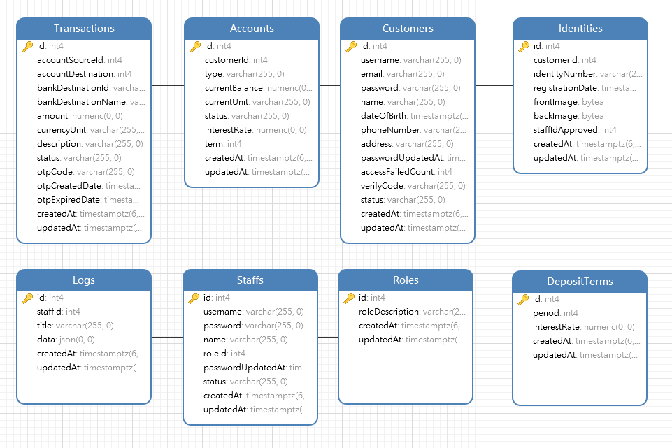

# ĐỒ ÁN LẬP TRÌNH WEB 2 - fit@hcmus
## Thông tin môn học
- Lớp: **CD2017/1**
- Học kỳ: **2 (2019-2020)**
- Giảng viên: **Đỗ Nguyên Kha**
- Thời gian: **Thứ 4, T4-6**
## Thông tin nhóm

| STT | MSSV    | Họ tên                   |
| --- | ------- | ------------------------ |
| 1   | 1760006 | **Nguyễn Trần Tuấn Anh** |
| 2   | 1760056 | **Nguyễn Đình Hậu**      |
| 3   | 1760075 | **Đặng Quốc Huy**        |
| 4   | 1760096 | **Nguyễn Vũ Linh**       |

## Thông tin đồ án

>### Đề tài
- Xây dựng ứng dụng **Internet Banking**

>### Công nghệ

- Client: **React, Redux, SCSS, Ant.Design**
- Server: **NodeJS, ExpressJS, PostgreSQL**

>### API documentation
- https://documenter.getpostman.com/view/11144072/T17M75b1

>### Database schema
